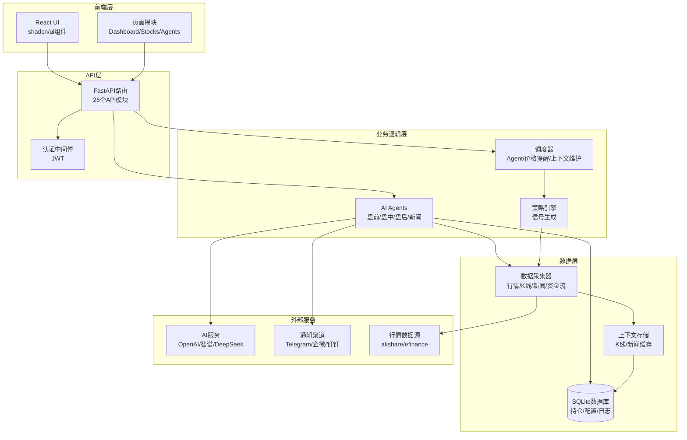

# PanWatch 代码阅读指南

## 📊 项目概览

**项目定位**: 私有部署的 AI 股票助手 — 实时行情监控、智能技术分析、多账户持仓管理

**技术栈**:
- **后端**: FastAPI + SQLAlchemy + APScheduler + OpenAI SDK
- **前端**: React 18 + TypeScript + Tailwind CSS + shadcn/ui
- **数据源**: akshare (A股) + efinance (行情) + Playwright (截图)
- **部署**: Docker 容器化,支持一键部署

---

## 🏗️ 架构分层



---

## 📁 核心模块解析

### 1️⃣ **入口文件** (`server.py`)
- 统一服务入口,集成 Web 后台 + Agent 调度
- 初始化数据库、日志、SSL 证书
- 注册 5 个核心 Agent 和 4 个调度器
- 启动 FastAPI 应用 (uvicorn)

### 2️⃣ **AI Agents** (`src/agents/`)
| Agent | 文件 | 触发时机 | 核心功能 |
|-------|------|---------|----------|
| 盘前分析 | `premarket_outlook.py` | 开盘前 | 综合隔夜美股、新闻、技术形态 |
| 盘中监测 | `intraday_monitor.py` | 交易时段实时 | RSI/KDJ/MACD 共振提醒 |
| 盘后日报 | `daily_report.py` | 收盘后 | 复盘走势、资金流向分析 |
| 新闻速递 | `news_digest.py` | 定时采集 | AI 筛选持仓相关新闻 |
| 图表分析 | `chart_analyst.py` | 按需调用 | K线形态识别、支撑压力位 |

### 3️⃣ **数据采集器** (`src/collectors/`)
- `akshare_collector.py` — A股实时行情 (akshare)
- `kline_collector.py` — K线数据采集
- `news_collector.py` — 财经新闻抓取
- `capital_flow_collector.py` — 资金流向数据
- `screenshot_collector.py` — Playwright 截图

### 4️⃣ **核心服务** (`src/core/`)
- `scheduler.py` — Agent 定时调度
- `price_alert_scheduler.py` — 价格提醒引擎
- `ai_client.py` — OpenAI 兼容客户端
- `notifier.py` — 多渠道通知管理器
- `strategy_engine.py` — 技术指标策略引擎
- `context_builder.py` — 为 Agent 构建上下文 (K线+新闻)

### 5️⃣ **Web API** (`src/web/api/`)
26 个 API 模块,核心包括:
- `auth.py` — 登录认证 (JWT)
- `stocks.py` — 股票管理 (增删改查)
- `agents.py` — Agent 配置和手动触发
- `price_alerts.py` — 价格提醒规则
- `dashboard.py` — 仪表盘数据聚合
- `trading.py` — 交易网关集成

### 6️⃣ **前端页面** (`frontend/src/pages/`)
- `Dashboard.tsx` — 仪表盘 (持仓概览、今日收益)
- `Stocks.tsx` — 股票管理 (添加自选、配置 Agent)
- `Agents.tsx` — Agent 配置 (调度时间、模型绑定)
- `PriceAlerts.tsx` — 价格提醒规则管理
- `Settings.tsx` — 系统设置 (AI 服务商、通知渠道)

---

## 🎯 完整阅读路径

### 路径 1: 整体架构理解 (推荐新手)

#### 第一步: 启动流程 (30分钟)
```
1. server.py (行 1-200)
   - 理解依赖导入和全局变量
   - setup_ssl() 和 setup_logging() 配置
   
2. server.py (行 200-400)
   - seed_agents() 注册 Agent
   - seed_data_sources() 注册数据源
   
3. server.py (行 400-600)
   - lifespan() 生命周期管理
   - 调度器初始化 (AgentScheduler, PriceAlertScheduler)
   
4. src/web/app.py
   - FastAPI 应用创建
   - 中间件配置
   - 路由注册
```

#### 第二步: 数据模型 (20分钟)
```
5. src/web/models.py (行 1-200)
   - Stock, Account, Position 持仓模型
   - AgentConfig, AgentRun Agent 配置
   
6. src/web/models.py (行 200-400)
   - AIService, AIModel AI 服务配置
   - NotifyChannel 通知渠道
   - PriceAlert 价格提醒规则
```

#### 第三步: Agent 核心机制 (1小时)
```
7. src/agents/base.py
   - AgentContext 上下文定义
   - BaseAgent 基类接口
   
8. src/agents/daily_report.py
   - 完整 Agent 实现示例
   - run() 方法执行流程
   
9. src/core/context_builder.py
   - build_agent_context() 构建上下文
   - K线数据、新闻数据聚合
   
10. prompts/daily_report.txt
    - Agent 的 Prompt 模板
```

#### 第四步: 调度系统 (40分钟)
```
11. src/core/scheduler.py
    - AgentScheduler 调度器
    - schedule_agent() 注册定时任务
    
12. src/core/schedule_parser.py
    - 解析 cron 表达式
    - 交易时段判断
    
13. src/core/agent_runs.py
    - record_agent_run 记录执行历史
```

#### 第五步: 数据采集 (30分钟)
```
14. src/collectors/kline_collector.py
    - collect_kline() K线采集
    - 数据标准化
    
15. src/collectors/akshare_collector.py
    - get_realtime_quote() 实时行情
    - A股/港股/美股适配
    
16. src/core/context_store.py
    - 上下文缓存机制
    - JSON 文件存储
```

---

### 路径 2: Agent 开发实战 (适合想扩展功能)

#### 第一步: 理解 Agent 接口
```
1. src/agents/base.py
   - AgentContext 数据结构
   - BaseAgent.run() 抽象方法
   
2. src/agents/daily_report.py
   - 参考实现: 数据采集 → AI 分析 → 通知推送
```

#### 第二步: 上下文构建
```
3. src/core/context_builder.py
   - build_agent_context() 完整流程
   - 如何获取 K线、新闻、持仓数据
   
 src/core/kline_context.py
   - K格式化
   - 技术指标计算
```

#### 第三步: AI 调用
```
5. src/core/ai_client.py
   - AIClient.chat() 方法
   - 多模型支持 (OpenAI/Gemini/Claude)
   
6. prompts/ 目录
   - 学习现有 Prompt 模板结构
```

#### 第四步: 通知推送
```
7. src/core/notifier.py
   - NotifierManager.send() 方法
   - Apprise 多渠道适配
   
8. src/core/notify_dedupe.py
   - 去重机制
```

#### 第五步: 注册新 Agent
```
9. server.py 中的 seed_agents()
   - 添加 Agent 元数据
   - 配置默认调度时间
   
10. src/core/agent_catalog.py
    - AGENT_SEED_SPECS 配置
```

---

### 路径 3: 前端开发 (适合 UI 开发者)

#### 第一步: 项目结构
```
1. frontend/src/main.tsx
   - React 应用入口
   
2. frontend/src/App.tsx
   - 路由配置 (react-rou)
   - 认证守卫
```

#### 第二步: 核心页面
```
3. frontend/src/pages/Dashboard.tsx
   - 仪表盘布局
   - 数据聚合展示
   
4. frontend/src/pages/Stocks.tsx
   - 股票列表
   - 添加/编辑表单
   
5. frontend/src/pages/Agents.tsx
   - Agent 配置界面
   - 手动触发按钮
```

#### 第三步: API 调用
```
6. frontend/src/hooks/ 目录
   - 自定义 hooks (useFetch, useAuth)
   
7. frontend/src/lib/ 目录
   - API 客户端封装
```

#### 第四步: 组件库
```
8. shadcn/ui 组件使用
   - Dialog, Select, Switch 等
   - Tailwind CSS 样式定制
```

---

### 路径 4: 策略引擎深入 (适合量化开发者)

#### 第一步: 策略框架
```
1. src/core/strategy_engine.py
   - StrategyEngine 核心类
   - evaluate_strategy() 策略评估
   
2. src/core/strategy_catalog.py
   - 内置策略定义
   - 策略注册机制
```

#### 第二步: 信号生成
```
3. src/core/signals/signal_pack.py
   - SignalPack 数据结构
   - 信号强度计算
   
4. src/core/signals/structured_output.py
   - AI 结构化输出解析
```

#### 第三步: 技术指标
```
5. src/collectors/kline_collector.py
   - MA, MACD, RSI, KDJ 计算
   
6. src/core/entry_candidates.py
   - 入场候选点识别
```

#### 第四步: 价格提醒
```
7. src/core/price_alert_engine.py
   - PriceAlertEngine 条件匹配
   - AND/OR 逻辑组合
   
8. src/core/price_alert_scheduler.py
   - 定时检查机制
   -时间控制
```

---

### 路径 5: API 开发 (适合后端开发者)

#### 第一步: FastAPI 基础
```
1. src/web/app.py
   - 应用创建和配置
   - CORS 中间件
   
2. src/web/database.py
   - SQLAlchemy 配置
   - 数据库初始化
```

#### 第二步: 认证系统
```
3. src/web/api/auth.py
   - JWT 登录/注册
   - get_current_user() 依赖注入
```

#### 第三步: 核心 API
```
4. src/web/api/stocks.py
   - CRUD 操作
   - 查询优化
   
5. src/web/api/agents.py
   - Agent 配置管理
   - 手动触发接口
   
6. src/web/api/dashboard.py
   - 数据聚合逻辑
   - 性能优化
```

#### 第四步: 响应封装
```
7. src/web/response.py
   - 统一响应格式
   - 错误处理
```

---

## 💡 关键设计亮点

1. **Agent 上下文隔离** — 每个 Agent 独立运行,通过 `AgentContext` 传递持仓、账户信息
2. **数据缓存机制** — K线和新闻存储在 `context_store`,避免重复采集
3. **通知去重** — `notify_dedupe.py` 防止短时间内重复推送
4. **多模型支持** — 可为不同 Agent 绑定不同 AI 模型 (GPT-4o/Gemini/Claude)
5. **价格提醒引擎** — 支持复杂条件组合 (AND/OR)、冷却时间、触发上限

---

## 🔍 快速定位指南

### 想理解某个功能如何实现?

| 功能 | 入口文件 | 关键函数 |
|------|---------|---------|
| 盘后日报生成 | `src/agents/daily_report.py` | `run()` |
| K线数据采集 | `src/collectors/kline_collector.py` | `collect_kline()` |
| 价格提醒触发 | `src/core/price_alert_engine.py` | `check_alert()` |
| Agent 定时调度 | `src/core/scheduler.py` | `schedule_agent()` |
| 股票添加 API | `src/web/api/stocks.py` | `create_stock()` |
| 仪表盘数据 | `src/web/api/dashboard.py` | `get_dashboard()` |

### 想修改某个行为?

| 需求 | 修改位置 |
|------|---------|
| 修改 Agent Prompt | `prompts/*.txt` |
| 调整调度时间 | `server.py` 中的 `seed_agents()` |
| 添加新技术指标 | `src/core/strategy_catalog.py` |
| 修改通知模板 | `src/core/notifier.py` |
| 调整 UI 样式 | `frontend/src/` 对应组件 |

---

## 📚 推荐阅读顺序总结

**第一次阅读 (2-3小时)**: 路径 1 (整体架构理解)
**想开发 Agent (1-2小时)**: 路径 2 (Agent 开发实战)
**想修改前端 (1小时)**: 路径 3 (前端开发)
**想研究策略 (2小时)**: 路径 4 (策略引擎深入)
**想扩展 API (1小时)**: 路径 5 (API 开发)

---

## 🚀 开始阅读

建议从 **路径 1** 开始,先理解整体架构,再根据兴趣深入特定模块。

每个文件阅读时,重点关注:
1. **数据流向** — 数据从哪来,到哪去
2. **依赖关系** — 调用了哪些其他模块
3. **核心逻辑** — 最重要的 3-5 个函数
4. **扩展点** — 哪里可以添加自定义功能

祝阅读愉快! 🎉
